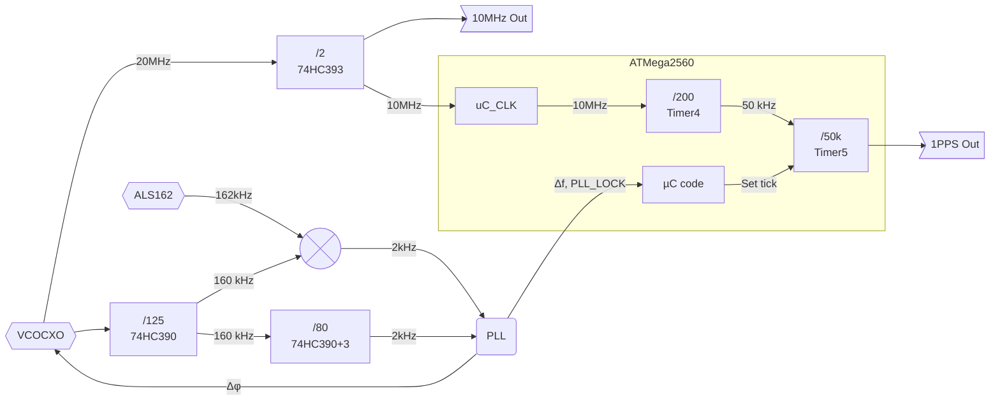

# Clock architecture
Using the ~~ATMega328~~ATMega2560, it is possible to accurately generate the 1PPS signal, by exclusively relying on hardware and timers.
A 50kHz signal is generated using `timer4`, based on the supplied 10 MHz clock. The 50kHz signal is transfered from `timer4` to `timer1` though a connection of ~~`OSC2A` (PortB_3)~~ to `T5` (~~PortD_5~~).

Initially, it was planned to do this with an ATMega328(P), but it appeared the 8 bit counters can't flip their output on a match to both OCRxB and OCRxA. Technically, we could rely on `timer2` to generate the 50kHz output on ATMega328, but this imply the counter *will* roll over once while timer1 stays the same, which is not acceptable in our case, since we want to timestamp time signal transitions beyond what a single 16-bit counter is able to track.

The firmware is left the task to adjust the 1PPS event timing and time signal management.

## Timer5 characteristics
Timer5 is set to:
  - Set OC5A High when it reaches `44999`.
  - Set OC5A Low and reset timer5 when it reaches `49999`.

## Sync modes
### Rough sync
Until the undocumented part content is reverse-engineed, a rough estimation of the 1PPS epoch is necessary.
Easiest way to do this is to rely on the 59th second, which is known to be unmodulated.

To do this, we measure the time to last interrupt. The first interrupt for which $`Δt > 500ms`$ is a good marker to set the epoch (don't forget to add the 50ms delay). 

### Fine sync
Once we're roughly synced, we can measure and store consecutive epochs (± a few samples), then adjust the epoch timer to mean value. More details to come.

## Propagation delay compensation
Compute the distance from your point of installation to `47.171585, 2.204646`. 

No need to get an up-to-the-meter precise location: the above coordinates is the middle point between the two masts used for transmission (1 being the active one, and the other being a reflector). This introduces a +/- 230 meters uncertainty (767ns), which is negligible, when compared to the epoch average uncertainty (~30µs/d according to Bulletin H[^1]).

[^1]: [Liste des bulletins H disponibles](https://syrte.obspm.fr/tfc/temps/outgoing_data/laboTAF/bulH/liste_bulh.php), LNE-SYRTE
