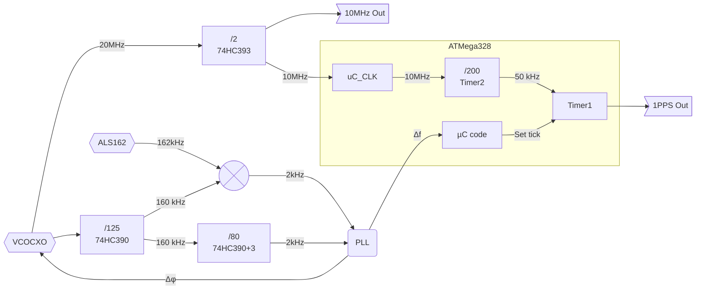

# Clock architecture
Using the ATMega328, it is possible to accurately generate the 1PPS signal, by exclusively relying on hardware and timers.

The firmware is left the task to adjust the 1PPS event timing and time signal management.

