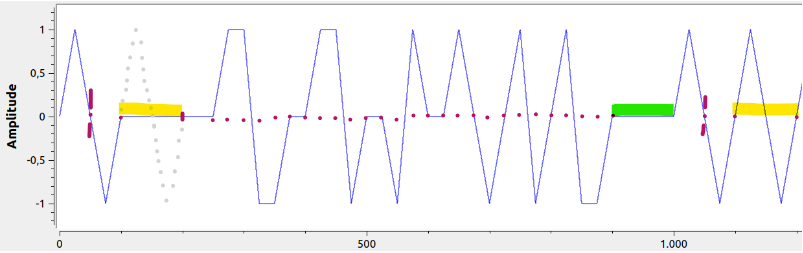

# ALS162 Time Signal
> [!WARNING]
> This document is in construction. Accuracy of its content is not guaranteed.

The Allouis time signal, formerly used as France Inter's AM center carrier, is now broadcasted as a standalone signal. It is defined by [NF C90-002:1988-08-01](https://www.boutique.afnor.org/fr-fr/norme/nf-c90002/radiodiffusion-et-telecommunication-systeme-de-diffusion-de-donnees-compati/fa034344/5651).

The signal is phase modulated, and is composed as follow (original illustration comes from GRcon23 slideware[^1]):



Decoding of the above waveform
```
Infered     : #### ____ ____ ____ ____ ____ ____ ____ ____ ____ ____ ____ ####
Displayed   : ____ #### #### #### #### #### #### #### #### #### #### ____ ____
TCM Symbols : 0000 0P0N 0000 000P PNN0 0PPN 00NP 00P0 N0PN 0PNN 0000 0P0N 0000
Epoch       :        !                                                 !
CTR overflow:      !                                                 !        
Transitions : X111 5723 1111 1159 8431 5983 1267 1572 3583 5843 1111 5723 111x
Frame bits  : 0000 1000 0000 0011 0000 1101 0010 1110 1101 1000 0000 1000 000x
```

## Waveform characteristics
  - The 59th second is not modulated (usable to find the 1PPS event)
  - The 1PPS event happens on the vertical marker, at the zero crossing on the falling edge, prior to the timecode bit time slot (colored in yellow).
  - The green time slot is defined as the "quiet" time slot, and can be used to measure signal phase.
  - The 250~900ms slot contains a 3-state signal, which content isn't currently documented. ~~Its notable characteristic, so far, is the number of `+π rad` and `-π rad` symbols are kept equal, to keep the long term phase average centered around zero radian.~~
  - Leap seconds are inserted on the 14th second.
  - Leap seconds are removed ~~on the 59th second~~.

## Timecode
> [!NOTE]
> TODO

[^1]: [ALS162 Time Signal SDR Receiver for GNU Radio](https://events.gnuradio.org/event/21/contributions/415/attachments/139/320/ALS162_slides_henningM1r.pdf), Henning Maier
