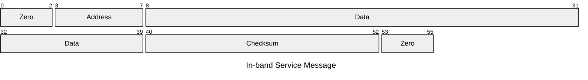

# Protocol specification
Version 0.0
> [!WARNING]
> This current version is a draft, and is subject to changes.

## Revision history

## Communication interface
The electrical interface used to communicate with the time signal receiver follows the RS232 standard.

The default interface settings are 4,800 bps 8N1. 
A high speed mode is available. Its settings are 38,400 bps 8N1.

A PPS signal, translated to RS-232 levels is provided on the DCD pin. The sync is provided on the rising edge (transition from mark to space).

An alarm signal, translated to RS-232 levels, is provided on the DSR pin. The alarm signal is considered active when the line *IS NOT* asserted. More details are supplied by the TXT sentences.

## DCE-originated sentences
This section defines the payload sent by the time signal receiver to the time signal consumer.

### MSS Sentence
This sentence almost follows the standard NMEA sentence format


### TXT Sentence

```
$ALTXT,NB,SQ,ID,text*CC
       ^---------- Number of messages (01-99)
	        ^------- Sequence ID of current message (01-99)
             ^---- Message type (00-99)
                ^- Payload (61 characters max)
IDs: 
01 -> Hardware info
02 -> Firmware version
03 -> Alarms ( 1 => Critical, 2 => Major, 3 => Minor, 4 => Warning) (L.text)
04 -> PPS Propagation compensation (N => Not active, U => User-supplied value, E => Determined by external GNSSDO reference), stored value? #TODO
05 -> Answer to host commands (ACK|NAK)
06 -> In-band service message (ASCIIhex encoded)
```

#### In-band service message
This receiver both decodes the time signal and the service messages that are eventually sent out.

Messages are encoded into ASCII hexadecimal form.

Due to peculiarities of the message format, adresses are zero-padded on the left, and the CRC is zero-padded on the right:


### ZDA Sentence
This sentence follows the standard NMEA sentence format

> [!IMPORTANT]
> Checksum of this sentence is deliberately kept invalid when continuous operation condition is not met.

### Example data
```text
$ALMSS,15,00,162.0,1*CC
$ALZDA,143115.631,23,07,2025,00,00*CC
$ALTXT,04,01,01,ALS162 Rcvr*CC
$ALTXT,04,02,02,v1.0*CC
$ALTXT,04,03,03,2.PLL UNLOCKED*CC
$ALTXT,04,04,03,1.PRIMARY PSU LOSS*CC
```

### DCE ABNF Grammar

```abnf
DCE_TID = ( "AL" / "GN" / "GP" )
DCE_CSUM = "*" 2*2HEXDIG

DCE_HMS = 6*6DIGIT *1( "." *DIGIT)
DCE_DAY = ( %x30-32 DIGIT / %x33 %x30-31 )
DCE_MONTH = ( %x30 %x31-39 / %x31 %x30-32 )
DCE_YEAR = 4*4DIGIT
DCE_TZ_OFFSET_HOUR = ( ["-"] %x30 DIGIT / %x31 %x30-34 / "-" %x31 %x30-32 )
DCE_TZ_OFFSET_MIN = %x30-35 DIGIT
DCE_ZDA = "ZDA," DCE_HMS "," DCE_DAY "," DCE_MONTH "," DCE_YEAR "," DCE_TZ_OFFSET_HOUR "," DCE_TZ_OFFSET_MIN

DCE_MSS = "MSS," 2*2DIGIT "," 2*2DIGIT "," 3*3DIGIT "." DIGIT

DCE_NUM_MSG = 2*2DIGIT
DCE_SEQ = 2*2DIGIT
DCE_TYPE = 2*2DIGIT
DCE_FREETEXT = 1*61( %x30-7e )
DCE_TXT = "TXT," DCE_NUM_MSG "," DCE_SEQ "," DCE_TYPE "," DCE_FREETEXT

DCE_FRAME = %x24 DCE_TID ( DCE_MSS / DCE_TXT / DCE_ZDA ) DCE_CSUM CRLF
```

## DTE-originated sentences
This section defines the format of messages that are sent by the time signal consumer to the time signal receiver.

Those messages essentially cover settings.

### 101 Sentence: set receiver location
This sentence is used to save the current receiver location. 

Format is a pair of floating point values in decimal degrees, using the WGS84 datum, describing the latitude, followed by a semi-colon, then the longitude.

Distance from the transmitter and associated propagation delay is computed by the time signal receiver firmware.

### 102 Sentence: Interface speed
This sentence can be used to change serial port from standard to high speed, and vice versa.

The message payload contains the expected value, in ASCII decimal form.

Before switching line speed, the time signal receiver sends a TXT sentence of type `05` to acknowledge the command.
Value:
  - `0`: Standard speed (4,800bps)
  - `1`: High speed (38,400bps)

### 103 Sentence: Set Talker ID
This sentence is used to switch the Talker ID value. 

This is provided to improve compatibility with poorly developed clients.
  - `0`: Default Talker ID (`AL`) 
  - `1`: Compatible Talker ID (`GN`)
  - `2`: Legacy Talker ID (`GP`)

### Examples
> [!WARNING]
> TODO: Generate valid sentences

```text
$PHOF101,lat_nmea,lon_nmea*CC
$PHOF102,bauds*CC
$PHOF103,compatible_mode*CC
```

### DTE ABNF Grammar
```abnf
DTE_LAT = ["-"] ( 1*2DIGIT / "1" ( %x30-37 DIGIT / "80" ) ) *1( "." 1*8DIGIT )
DTE_LON = ["-"] ( 1*1DIGIT / %x30-38 DIGIT / "90" ) *1( "." 1*8DIGIT )
DTE_SETLOC = "101," DTE_LAT "," DTE_LON
DTE_SETBAUD = "102," ( "4800" / "38400" )
DTE_SETTID = "103," %30-32
DTE_CSUM = "*" 2*2HEXDIG
DTE_FRAME = %x24 "PHOF" ( DTE_SETLOC / DTE_SETBAUD / DTE_SETTID ) DTE_CSUM CRLF
```
